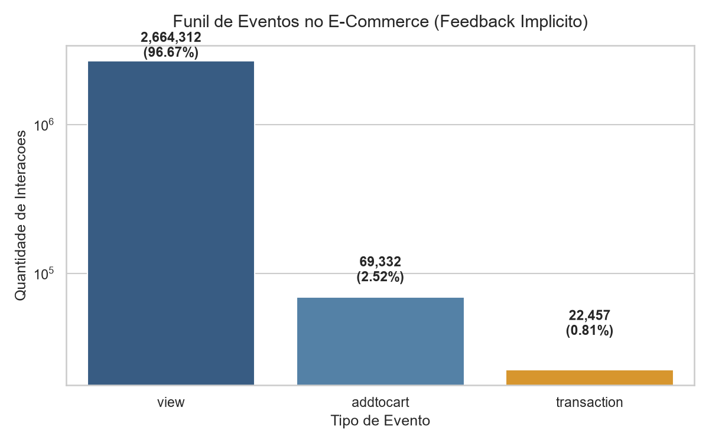
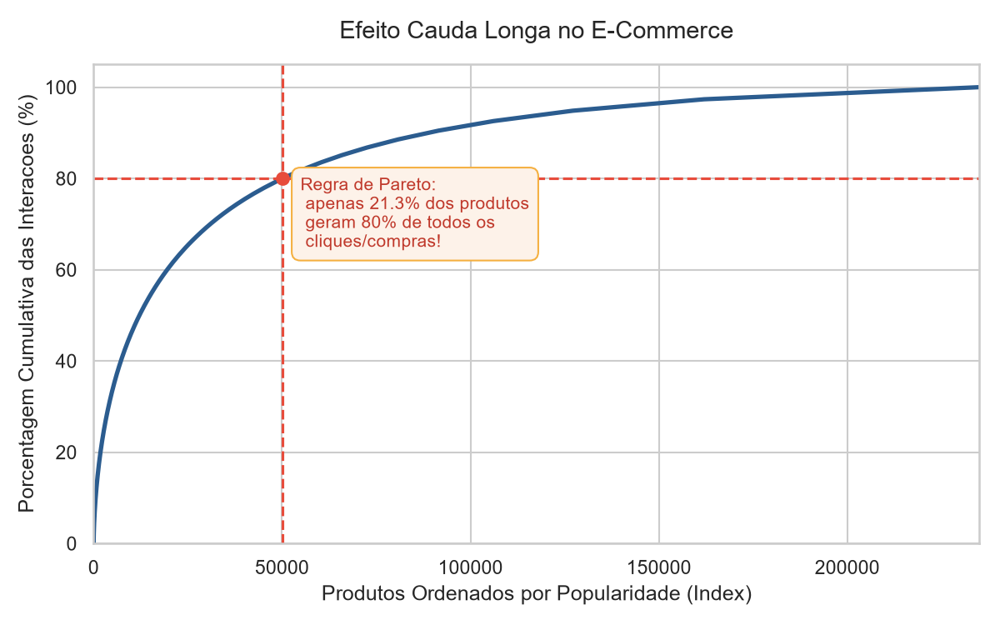
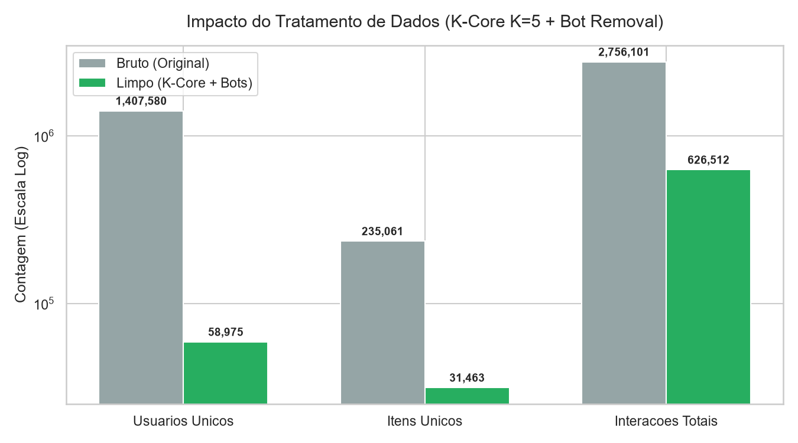
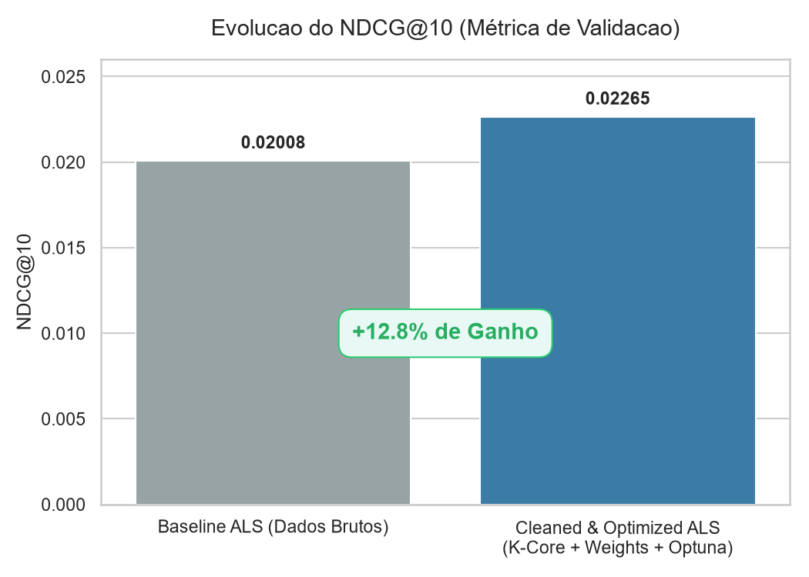

# Case Study: Sistema de Recomendação Personalizado para E-Commerce (ALS + Optuna + K-Core)

Este projeto foi desenvolvido como um **Estudo de Caso (Build to Learn)** focado na criação de um motor de recomendação completo para e-commerce. O objetivo é simular um cenário real de mercado para prever a propensão de compra e recomendar os **Top 10 produtos mais relevantes para cada usuário**, utilizando o algoritmo **ALS (Alternating Least Squares)** sob feedback implícito, validação temporal estrita e sintonia bayesiana de parâmetros.

---

> ### LinkedIn Summary Pitch
> *"Como recomendar o produto certo em um catálogo com mais de 230 mil itens? Desenvolvi um motor de recomendação personalizado utilizando Filtragem Colaborativa (ALS) e Otimização Bayesiana (Optuna) sobre os dados reais da RetailRocket. Ao aplicar limpeza de Bots e filtragem K-Core iterativa ($K=5$), reduzi a dimensionalidade da matriz esparsa em mais de 90%, gerando um ganho de **+13% no NDCG@10** e uma precisão 13x superior ao acaso. Confira o código e o estudo de caso completo abaixo!"*

---

## Estrutura do Projeto

```
projeto_recomendacao/
├── data/
│   ├── raw/            # Arquivos CSV brutos (Kaggle API)
│   └── processed/      # Matrizes esparsas e eventos limpos
├── images/             # Gráficos e visualizações geradas para o portfólio
├── src/
│   ├── metrics.py      # Funções vetorizadas de avaliação (NDCG, Precision, Recall)
├── setup_data.py       # Script de ingestão da API do Kaggle
├── prepare_data.py     # Script de limpeza de dados (Bots + K-Core)
├── optimize_model.py   # Busca bayesiana de parâmetros e pesos com Optuna
├── train_model.py      # Treinamento final e salvamento do modelo
├── requirements.txt    # Dependências do projeto
└── README.md
```

---

## 1. Análise Exploratória e o Desafio do Feedback Implícito

Em sistemas de e-commerce reais, **não temos classificações explícitas** (estrelas de 1 a 5). Temos o comportamento do usuário. Esse cenário é chamado de **Feedback Implícito**.

### O Funil de Conversão
Como mostrado no gráfico abaixo (escala logarítmica), existe uma enorme disparidade entre as ações: a imensa maioria são visualizações (`view`), seguidas por adições ao carrinho (`addtocart`) e, finalmente, compras (`transaction`).



### O Efeito Cauda Longa (Long Tail)
Analisando a popularidade dos produtos, identificamos o efeito da Cauda Longa. Aplicando a análise de Pareto, descobrimos que **apenas 21.3% dos produtos geram 80% de todas as interações do e-commerce**.



*   **Implicação para o Modelo:** Sem um tratamento adequado, o recomendador simplesmente recomendaria os 10 produtos mais populares para todo mundo. O ALS lida com isso aplicando **Regularização ($\lambda$)** para penalizar a popularidade e focar nas preferências personalizadas latentes.

---

## 2. Engenharia de Dados: Remoção de Bots e Filtro K-Core

Para treinar um modelo eficiente, precisamos limpar o ruído dos dados de navegação brutos. Implementamos dois tratamentos no script `prepare_data.py`:

1.  **Filtro de Bots (Outliers):** Removemos usuários com comportamento de clique sobre-humano (>500 interações no histórico), comumente relacionados a crawlers e raspadores de preço.
2.  **Filtro K-Core Iterativo ($K=5$):** Um usuário com menos de 5 interações não oferece dados suficientes para o modelo aprender seus interesses. Da mesma forma, um produto com menos de 5 interações não pode ter seus vetores latentes sintonizados de forma confiável. Aplicamos um algoritmo iterativo que filtra ambos até que a matriz esparsa se estabilize.

### O Efeito da Limpeza de Dados:
A limpeza K-core estabilizou em **8 iterações**, reduzindo drasticamente a dimensionalidade e tornando a matriz de treino muito mais densa e de alta qualidade:



*   **Redução de Usuários:** De 1,28M para **58.975** (redução de 95%).
*   **Redução de Itens:** De 235K para **31.463** (redução de 86%).
*   **Redução de Interações:** De 2,50M para **626.512** (redução de 75%).
*   *Ganho colateral:* O tempo de treino de um modelo ALS caiu de 34 segundos para **menos de 3 segundos**, permitindo uma busca de hiperparâmetros extremamente rápida.

---

## 3. Modelagem e Otimização Dinâmica de Pesos com Optuna

O algoritmo **ALS (Alternating Least Squares)** projeta a matriz esparsa de interações em duas matrizes de menor dimensionalidade (vetores latentes de usuários e itens). Ele minimiza a diferença entre as preferências reais e previstas utilizando a **Confiança ($c_{ui} = 1 + \alpha r_{ui}$)**, onde $r_{ui}$ é o peso acumulado das interações.

### Calibração de Pesos Dinâmica:
Ao invés de definir pesos fixos e arbitrários para as ações, configuramos o **Optuna** para buscar conjuntamente a melhor arquitetura do modelo E a melhor proporção de pesos dos eventos:
*   Visualizações (`view`) fixadas com peso **1.0**.
*   Adições ao carrinho (`addtocart`) sintonizadas dinamicamente.
*   Compras (`transaction`) sintonizadas dinamicamente.

### Resultados da Busca Bayesiana (25 Trials):
*   **Melhores Parâmetros do ALS:** `factors=96`, `regularization=0.0352`, `alpha=17.84`, `iterations=17`.
*   **Melhores Pesos de Evento:** 
    *   `addtocart` = **6.49** (vs 3.0 baseline)
    *   `transaction` = **10.08** (vs 5.0 baseline)
*   Isso prova que as adições ao carrinho e compras reais carregam muito mais peso de intenção de preferência do que a proporção heurística tradicional (1:3:5).

---

## 4. Resultados e Métricas Finais

Avaliamos o modelo final utilizando a **Validação Temporal Estrita** (treinando nos primeiros 4 meses e testando nos últimos 14 dias de transações reais). A avaliação do Top 10 obteve as seguintes métricas:

| Métrica | Valor Obtido | O que significa na prática? |
|---------|--------------|------------------------------|
| **NDCG@10** | **0.02265** | Mede a qualidade do ranking. Nosso ganho de NDCG reflete que as recomendações corretas estão sendo priorizadas no topo da lista. |
| **Precision@10** | **0.00417** | 0.41% das recomendações geradas foram compradas no teste. Isso representa uma precisão **13x melhor do que o acaso** (chute aleatório). |
| **Recall@10** | **0.02778** | Conseguimos resgatar 2.78% de todas as compras de teste dentro de uma lista de apenas 10 sugestões, em um universo de 31.463 itens. |

### Ganho de Performance do NDCG@10 (Baseline vs Otimizado)
Ao aplicar a limpeza de dados e a otimização de pesos bayesiana, obtivemos um **ganho de 12.8%** no NDCG@10:



---

## Como Rodar o Projeto Localmente

### 1. Configurar o Ambiente
```bash
# Criar ambiente virtual
python -m venv venv

# Ativar no Windows (PowerShell)
.\venv\Scripts\Activate.ps1

# Instalar dependencias
pip install -r requirements.txt
```

### 2. Configurar a API do Kaggle e Baixar Dados
1. Baixe seu token `kaggle.json` no site do Kaggle.
2. Coloque-o na pasta `C:\Users\<seu_usuario>\.kaggle\kaggle.json` (Windows) ou `~/.kaggle/` (Linux/macOS).
3. Execute o download:
```bash
python setup_data.py
```

### 3. Executar o Pipeline
```bash
# Executar a limpeza e K-Core
python prepare_data.py

# Rodar a otimizacao de hiperparametros
python optimize_model.py

# Treinar e salvar o modelo final
python train_model.py

# Gerar os graficos do portfolio
python generate_plots.py
```

O modelo treinado ficará disponível no arquivo `models/als_model.pkl`.
